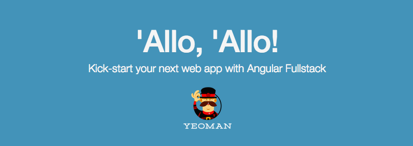

# 環境構築

1. ツール類のインストール
1. リポジトリのクローンと依存モジュールのインストール
1. 動作確認

## 1. ツール類のインストール

ハンズオンで必要なツール類をインストールします。
まず、こちらのツールをインストールします。

- Node.js
- git
- mondodb

正常にインストールできたことを確認します。

```
node -v
> v0.12.7
npm -v
> 2.11.3
git --version
> git version 2.5.0
mongo --version
> MongoDB shell version: 3.0.5
```

続いて利用するnpmモジュールをグローバルインストールします。

```
npm install -g yeoman bower grunt-cli
npm install -g generator-angular-fullstack
```

:warning:  `permission denied`エラーが出る場合は適宜`sudo`してください。

## 2. リポジトリのクローンと依存モジュールのインストール

次のリポジトリをクローンします。

// TODO  
<https://github.com/mitsuruog/mean-heroku-sample.git>

```
git clone https://github.com/mitsuruog/mean-heroku-sample.git && cd _
```

依存モジュールをインストールします。

```
npm install
bower install
```

## 3. 動作確認

動作確認を行います。

まず、ローカルPC上でmondodbを起動します。  
mondodbのデータストアの場所はプロジェクト直下の`.data`とします。

```
mkdir .data
mongod --dbpath .data
```

ローカル開発用サーバを起動します。  
<http://localhost:9000>でアプリケーションが実行し、ブラウザ上で表示されます。
```
grunt serve
```



Javascriptファイルなどを監視して様々なタスクがバックグラウンドで動作しています。  
そのため、ハンズオン中は開発用サーバーを起動したまま行います。

> yo angular-fullstack [app-name]の話

----
[:point_right: 2. アプリケーション構成](../02)
