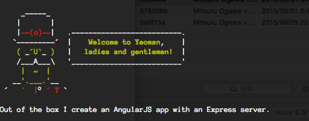

# 環境構築

1. ツール類のインストール
1. プロジェクトの作成
1. 動作確認

## 1. ツール類のインストール

ハンズオンで必要なツール類をインストールします。
まず、こちらのツールをインストールします。

- [Node.js](https://nodejs.org/)
- [git(SourceTree)](https://www.atlassian.com/ja/software/sourcetree/overview)
- [mongodb](https://www.mongodb.org/)

正常にインストールできたことを確認します。

```
node -v
> v0.12.7
npm -v
> 2.11.3
git --version
> git version 2.5.0
mongo --version
> MongoDB shell version: 3.0.5
```

続いて利用するnpmモジュールをグローバルインストールします。

```
npm install -g yo bower grunt-cli
npm install -g generator-angular-fullstack
```

:warning:  `permission denied`エラーが出る場合は適宜`sudo`してください。

## 2. プロジェクト作成

プロジェクト用のフォルダを作成します。

```
mkdir mean-heroku-sample
cd mean-heroku-sample
```

angular fullstackのgeneratorを使ってプロジェクトの雛形を生成します。
途中の設問は次のようにしてください。



```
yo angular-fullstack photoShare

_-----_
|       |
|--(o)--|   .--------------------------.
`---------´  |    Welcome to Yeoman,    |
( _´U`_ )   |   ladies and gentlemen!  |
/___A___\   '__________________________'
|  ~  |
__'.___.'__
´   `  |° ´ Y `

Out of the box I create an AngularJS app with an Express server.

# Client

? What would you like to write scripts with? JavaScript
? Would you like to use Javascript ES6 in your client by preprocessing it with Babel? Noith Babel? (Y/n) n
? What would you like to write markup with? HTML
? What would you like to write stylesheets with? CSS
? What Angular router would you like to use? uiRouter
? Would you like to include Bootstrap? Yes
? Would you like to include UI Bootstrap? Yes

# Server

? Would you like to use mongoDB with Mongoose for data modeling? Yes
? Would you scaffold out an authentication boilerplate? Yes
? Would you like to include additional oAuth strategies? Google
? Would you like to use socket.io? No

You're using the fantastic NgComponent generator.

Initializing yo-rc.json configuration.

create .gitignore
create bower.json


...(詳細)


grunt-node-inspector@0.1.6 node_modules/grunt-node-inspector
└── node-inspector@0.9.2 (debug@1.0.4, async@0.9.2, serve-favicon@2.3.0, semver@3.0.1, which@1.1.1, rc@0.5.5, yargs@1.3.3, strong-data-uri@0.1.1, glob@4.5.3, biased-opener@0.2.6, ws@0.4.32, v8-profiler@5.2.12, v8-debug@0.4.6)

>
```

> :gift_heart: モジュールを再インストールする場合は次のコマンドを実行します。
```
npm install
bower install
```

## 3. 動作確認

動作確認を行います。

まず、ローカルPC上でmondodbを起動します。
mondodbのデータストアの場所はプロジェクト直下の`.data`とします。

```
mkdir .data
mongod --dbpath .data
```

ローカル開発用サーバを起動します。
<http://localhost:9000>でアプリケーションが実行し、ブラウザ上で表示されます。
```
grunt serve
```


Javascriptファイルなどを監視して様々なタスクがバックグラウンドで動作しています。
そのため、ハンズオン中は開発用サーバーを起動したまま行います。

> yo angular-fullstack [app-name]の話

----
[:point_right: 2. アプリケーション構成](../02)
