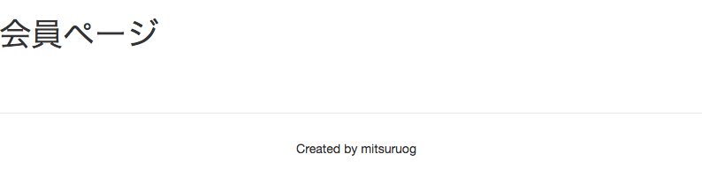

# 画像シェアサービスの概要

1. WebAPI一覧
2. 画面一覧
3. 画面・WebAPIの自動生成

## 1. WebAPI一覧

WebAPI(以下、API)のエンドポイントは`/api/`とします。

API仕様は次の通りです。

|URL|Method|認証|概要|
| --- | --- |--- | --- |
| photos/ | GET | | 公開画像取得 |
| photos/me | GET | 要 | プライベート画像取得 |
| photos/me | POST | 要 | 画像アップロード |
| photos/me/:id | PUT | 要 | 画像シェア設定変更 |
| photos/me/:id | DELETE | 要 | 画像削除 |

ハンズオンでは`photos`以下のAPIを作成します。

## 2. 画面一覧

画面一覧は以下の通りです。

|画面名|URL|認証|概要|
| --- | --- | --- | --- |
| トップ | / |  | トップ画面。公開画像をカルーセルで表示する |
| ログイン | /login |  | ログイン画面 |
| 会員登録 | /signup |  | 新規会員登録画面 |
| パスワード変更 | /settings | 要 | パスワード変更画面 |
| 会員ページ | /me | 要 | 会員のプライベート画面。画像のアップロード・削除・シャア設定ができる |

会員ページ以外は`angular-fullstack`でプロジェクトを作成したタイミングで自動生成されます。

## 3. 画面・WebAPIの自動生成

では最後に`angular-fullstack`が持っているgenerator機能を利用してハンズオンで追加するAPIと画面を生成します。

まず、APIを生成します。

```
yo angular-fullstack:endpoint photo

> ? What will the url of your endpoint be? /api/photos
>    create server/api/photo/index.js
>    create server/api/photo/photo.controller.js
>    create server/api/photo/photo.model.js
>    create server/api/photo/photo.spec.js
```

`server/api/photo`配下にファイルが作成されていることを確認します。

次に、会員ページを生成します。


```
yo angular-fullstack:route me

> ? Where would you like to create this route? client/app/
> ? What will the url of your route be? /me
>    create client/app/me/me.js
>    create client/app/me/me.controller.js
>    create client/app/me/me.controller.spec.js
>    create client/app/me/me.css
>    create client/app/me/me.html
```

`client/app/me`直下にファイルが作成されていることを確認します。
ひとまず、会員ページを次のように変更し、表示されることを確認します。

__client/app/me/me.html__

```
<div ng-include="'components/navbar/navbar.html'"></div>

<!-- 以降はここを編集していきます -->
<h1>会員ページ</h1>

<footer class="footer">
    Created by [あなたの名前]
</footer>
```

<http://localhost:9000/me> にアクセスすると会員ページが表示されます。



----
[:point_right: 5. 画像アップロード機能の作成](../05)

[:point_left: 3. Herokuの準備とデプロイ](../03)
