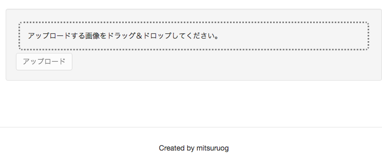
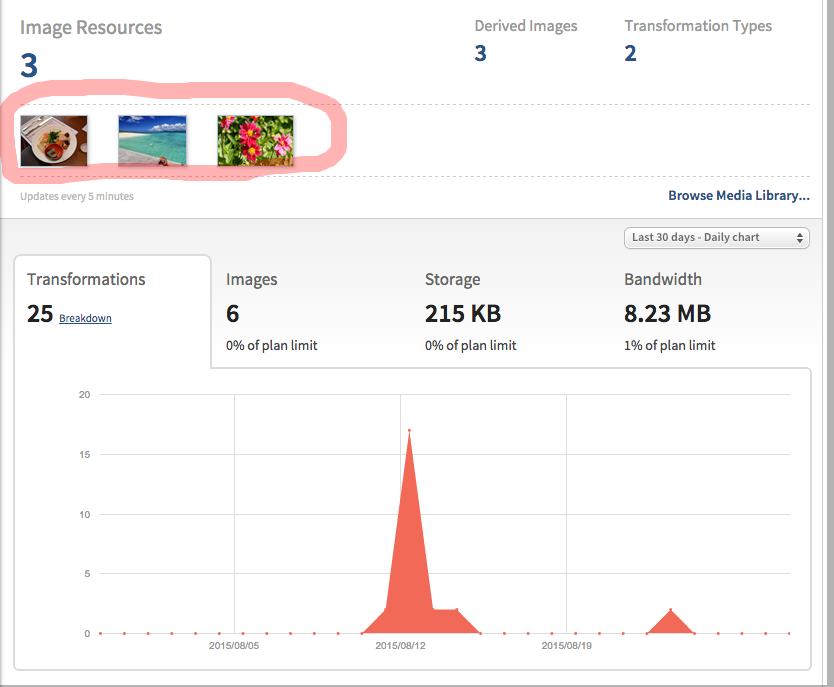

# 画像アップロード機能の作成

2. PhotoModelの作成
3. Cloudinary共通サービスの作成
1. サーバー側ルーターの設定
4. サーバー側Controllerの作成
5. フロント側ルーターの設定
6. 会員ページへアップロードボタンを追加
7. フロント側Controller作成
7. Herokuへデプロイ

## PhotoModelの作成

mondoDB上のPhotoModelを作成します。

__server/api/photo/photo.model.js__
```js
var mongoose = require('mongoose'),
    Schema = mongoose.Schema;

var PhotoSchema = new Schema({
  name: String,
  url: String,
  owner: {
    type: Schema.Types.ObjectId,
    ref: 'User'
  },
  publicId: String,
  share: Boolean
});

module.exports = mongoose.model('Photo', PhotoSchema);
```
各項目の意味などは次の通りです。

|項目名|概要|
| --- | --- |
| name | 画像名(今回は利用しません) |
| url | Cloudinary上の公開画像URL |
| publicId | Cloudinary上の公開画像ID |
| owner | 画像オーナー(Userテーブルとリレーションしています) |
| share | 公開可否フラグ |

## Cloudinary共通サービスの作成

### Cloudinary APIKeyの取得

まず、CloudinaryAPIキーを確認します。  
CloudinaryAPIキーはHerokuのDashboardのSettingから確認することができます。


`server/config/local.env.sample.js`を同じフォルダにコピーしてください。
`local.env.js`リネームして、CloudinaryAPIキーを設定します。

__local.env.js__
```js
module.exports = {
  DOMAIN:           'http://localhost:9000',
  SESSION_SECRET:   'sample-secret',

  CLOUDINARY_URL: '<あなたのAPIKey>',

  // Control debug level for modules using visionmedia/debug
  DEBUG: ''
};
```

(注意)`local.env.js`はセキュアな情報を保存するため、git上にcommitしないように注意してください。本リポジトリでは事故を防ぐため`.gitignore`に指定しています。

### 共通サービスの作成

CloudinaryAPIをラップした共通サービスモジュールを作成します。  
まず、CloudinaryのNode.js用SDKとアップロードされたファイルを扱うためのモジュールをインストールします。

```
npm install cloudinary connect-multiparty --save
```

続いて、`server/cloudinary/cloudinary.service.js`を作成します。

__server/cloudinary/cloudinary.service.js__

```js
var config = require('../config/environment');
var cloudinary = require('cloudinary');

// アップロード機能
function upload(file) {
  return cloudinary.uploader.upload(file);
}

// 画像削除機能
function remove(publicId) {
  return cloudinary.api.delete_resources([publicId]);
}

// 外部モジュールとして公開
exports.upload = upload;
exports.remove = remove;
```

> :gift_heart: Cloudinaryへの接続情報は、CloudinaryのNode.js用SDKが環境変数の`CLOUDINARY_URL`を参照して自動設定するようになっています。  
[cloudinary/cloudinary_npm - configuration](https://github.com/cloudinary/cloudinary_npm#configuration)

> :gift_heart: angular-fullstack上はexpressサーバ起動時に`grunt-env`が`server/config/local.env.sample.js`の内容を環境変数へバインドする仕組みを持っています。

## サーバー側ルーターの設定

サーバー側のルーターにて機能とURLをマッピングします。

__server/api/photo/index.js__

```js
var express = require('express');
var controller = require('./photo.controller');

// 認証モジュールを追加します
var auth = require('../../auth/auth.service');

// アップロード画像を取り扱うモジュールを追加します
var multiparty = require('connect-multiparty');
var multipartyMiddleware = multiparty();

var router = express.Router();

// `/me`と`controller.upload`をマッピングします
// multipartyMiddlewareを経由することで、アップロードファイルをControllerにて取り扱う形に変換することができます
router.post('/me', auth.isAuthenticated(), multipartyMiddleware, controller.upload);

module.exports = router;
```

## サーバー側Controllerの作成

### 画像アップロードAPI作成

続いて、Controller側の処理を記述します。

__server/api/photo/photo.controller.js__

```js
// cloudinary共通サービスを追加します
var cloudinary = require('../../cloudinary/cloudinary.service');

// 写真をアップロード
exports.upload = function(req, res) {

  // アップロードされたファイルはmultipartyMiddlewareを経由して
  // req.files.fileにバンドルされています
  if(req.files.file) {

    var file = req.files.file.path;

    // Cloudinary上に写真をアップロード
    cloudinary.upload(file).then(function(result){
      
      // サンプルレスポンス
      //{ 
      //  public_id: 'sample',
      //  version: 1312461204,
      //  width: 864,
      //  height: 576,
      //  format: 'jpg',
      //  bytes: 120253,
      //  url: 'http://res.cloudinary.com/demo/image/upload/v1371281596/sample.jpg',
      //  secure_url: 'https://res.cloudinary.com/demo/image/upload/v1371281596/sample.jpg' 
      //}

      // PhotoModelを作成します
      var photo = new Photo();
      
      // 認証済みユーザの情報はreq.userにバンドルされています
      photo.owner = req.user.id;
      photo.name = result.version;
      photo.url = result.url;
      photo.publicId = result.public_id;

      // mondoDBへ追加します
      Photo.create(photo, function(err, photo) {
        if(err) { return handleError(res, err); }
        // 作成結果を返します
        return res.status(201).json(photo);
      });

    });

  }

};

```

以上でサーバー側の準備は完了です。

## フロント側ルーターの設定

会員ページはログイン後にアクセスできるようになるため、ログインしていない場合はアクセスさせないようにする必要があります。

angular-fullstackには、既にクライアント側の認証モジュールが含まれているため、今回のようにログインしている場合のみ表示させたい場合は、ルーターの設定に認証フィルターを設定することで実現可能です。
クライアント側のルーターは、各コンポーネントフォルダの直下に`<コンポーネント名>.js`という形で作成されています。

__client/app/me/me.js__

```js
'use strict';

angular.module('sampleApp')
  .config(function ($stateProvider) {
    $stateProvider
      .state('me', {
        url: '/me',
        templateUrl: 'app/me/me.html',
        controller: 'MeCtrl',
        // 認証フィルターを設定します
        authenticate: true
      });
  });
```

これで、ログインしていない状態で`http://localhost:9000/me`にアクセスすると、ログイン画面が表示されるようになります。

## 会員ページへアップロードボタンを追加

まず、アップロード機能を追加するため、`ng-file-upload`モジュールを追加します。

```
bower install --save ng-file-upload
```

追加したモジュールを有効にするため、トップレベルのアプリケーションに依存関係を追加します。

__client/app/app.js__

```js
angular.module('sampleApp', [
  'ngCookies',
  'ngResource',
  'ngSanitize',
  'ui.router',
  'ui.bootstrap',
  'ngFileUpload'  // ここにモジュールを追加します
])
```

続いて、会員ページにアップロード用のエリアを追加します。

__client/app/me/me.html

```html
<div class="container">
  <div class="well">
    <!-- ファイルをドラッグ＆ドロップするエリア -->
    <div ngf-drop ngf-select ng-model="file" class="drop-box"
         ngf-drag-over-class="dragover" ngf-multiple="false" ngf-allow-dir="false"
         ngf-accept="'image/*'">アップロードする画像をドラッグ＆ドロップしてください。</div>
    <!-- HTML5 File APIがサポートされていない場合に表示される -->
    <div ngf-no-file-drop>このブラウザではドラッグ＆ドロップがサポートされていません。</div>
    <!-- アップロードするファイルのプレビュー表示 -->
    
    <!-- アップロード処理を行うボタン -->
    <div>
      <button type="button" class="btn btn-default" ng-click="upload(file)" ng-disabled="!file">アップロード</button>
    </div>
  </div>
</div>
```

アップロードエリアのスタイルを微調整するため、スタイルを追加します。

__client/app/me/me.css__

```css
.drop-box {
  margin: 5px;
  padding: 15px;
  border: dotted 3px gray;
  border-radius: 7px;
}

.preview-box {
  max-height: 400px;
  margin: 7px;
}
```

## フロント側Controller作成

続いてControllerに画像アップロード機能を追加します。

__client/app/me/me.controller.js__

```js
'use strict';

angular.module('sampleApp')
  .controller('MeCtrl', function ($scope, Upload) { // Uploadを追加します

    // アップロード画像を保持するプロパティ
    $scope.photos = [];

    /* jshint unused: false */
    $scope.upload = function (file) {
      if(file) {
        Upload.upload({
          url: '/api/photos/me',
          method: 'POST',
          file: file
        }).success(function (data, status, headers, config) {
          // アップロードが完了した場合、リストに追加します。
          $scope.photos.push(data);
          // 成功した場合はファイルを削除します。
          $scope.file = null;
        }).error(function (data, status, headers, config) {
          console.log('error status: ' + status);
        });
      }
    };

  });
```

以上でアップロード機能は完成です。
ログインした状態でアクセスすると、次のような画面が表示されるはずです。



また、アップロード画像はCloudinaryのダッシュボードにて確認することができます。



> :gift_heart: Herokuのアドオンはそれぞれ独立したサービスとなっており、Herokuのアドオンのリンクをクリックすることで、各サービスへSSOすることができます。


## Herokuへデプロイ

ローカルでの動作確認が終わったら、heroku上にデプロイしましょう。  
アプリケーションをherokuへデプロイします。

```
grunt build
grunt buildcontrol:heroku
```

デプロイされた画面を確認してください。

----
[:point_right: 6. アップロード画像サムネイルの作成](../06)

[:point_left: 4. 画像シェアサービスの概要](../04)
